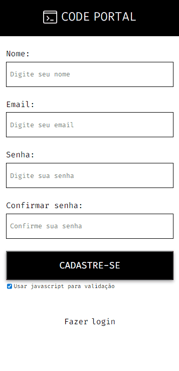

<h1>Blog Code Portal</h1>

 

<h2>🔗 Tópicos</h2>
<ul>
<li><a href="#about">Sobre</a></li>
<li><a href="#tools">Ferramentas</a></li>
<li><a href="#features">Features</a></li>
<li><a href="#db">Modelagem</a></li>
<li><a href="#project">Projeto</a></li>
<li><a href="#project">Projeto</a></li>
<li><a href="#how_to_use">Como usar</a></li>
</ul>

<h2 id="about" style="margin-top: 30px;">📖 Sobre</h2>

Blog compartilhado de tecnologia, basta criar uma conta e fazer seus posts de tecnologia

<h2 id="tools" style="margin-top: 30px;">🛠️ Principais ferramentas</h2>

<ul>
<li>Fast</li>
<li>Django</li>
<li>Django Rest Framework</li>
<li>Django-summernote</li>
<li>Celery</li>
<li>Redis</li>
<li>Postgres</li>
<li>Celery beat</li>
<li>Flower</li>
<li>Docker</li>
<li>Docker-compose</li>
</ul>

<h2 id="features" style="margin-top: 30px;">🚀 Features</h2>

<ul>
<li>Django ORM</li>
<li>Autenticação do Django</li>
<li>Formulários com Fast</li>
<li>Tarefas usando Celery</li>
<li>Tarefas agendadas usando Celery beat</li>
<li>Dashboard de tarefas usando Flower</li>
<li>Sistema de mensagens com Fast</li>
<li>Campo de texto para posts usando Django-summernote</li>
<li>Javascript consumindo APIs</li>
<li>Site responsivo</li>
<li>Micro SPAs</li>
<li>Admin personalidzado</li>
<li>Envio de email</li>
<li>Cache</li>
</ul>

<h2 id="db" style="margin-top: 30px;">🏷️ Modelagem do banco de dados</h2>

<h3>User</h3>
<ul>
<li>Nome</li>
<li>Username ( gerenciada pelo AbstractUser do Django )</li>
<li>Email</li>
<li>Senha ( gerenciada pelo AbstractUser do Django )</li>
<li>Posts M2M</li>
<li>Foto de perfil</li>
</ul>

<h2 id="project"  style="margin-top: 30px;">🎥 Projeto</h2>
<ul>

<li style="margin-top: 30px;">
<h3>Sistema de administração</h3>

</li>

<li style="margin-top: 30px;">
<h3>Flower</h3>

</li>

<li style="margin-top: 30px;">
<h3>Cadastro</h3>

</li>

<li style="margin-top: 30px;">
<h3>Usuário salvo no sistema de administração</h3>

</li>

<li style="margin-top: 30px;">
<h3>Validação de formulário pelo backend</h3>

Está feature está presente em todos os formulários do sistema

</li>

<li style="margin-top: 30px;">
<h3>Validação de formulário pelo frontend</h3>

Está feature está presente em todos os formulários do sistema

</li>

<li style="margin-top: 30px;">
<h3>Login no sistema</h3>

</li>

<li style="margin-top: 30px;">
<h3>Erros no login</h3>

</li>

<li style="margin-top: 30px;">
<h3>Alterar dados básicos</h3>

Ao criar seu perfil, o sistema sorteia uma foto de usuário, você pode editar essa foto do mesmo modo que edita uma foto de um post

</li>

<li style="margin-top: 30px;">
<h3>Alterar senha</h3>

</li>

<li style="margin-top: 30px;">
<h3>Alterar email</h3>

</li>

<li style="margin-top: 30px;">
<h3>Enviando sugestões</h3>

O usuário não pode criar categorias e subcategorias, mas ele pode enviar sugestões para os administradores

</li>

<li style="margin-top: 30px;">
<h3>Sugestões no sistema de administração</h3>

</li>

<li style="margin-top: 30px;">
<h3>Respostas das sugestões</h3>

As respostas são registradas após o administrador mudar o estado das sugestões no sistema de administração

</li>

<li style="margin-top: 30px;">
<h3>Criando um post</h3>

</li>

<li style="margin-top: 30px;">
<h3>Editando um post</h3>

A seção EDITAR lista seus posts publicados e a seção RASCUNHOS lista seus posts não publicados

</li>

</ul>
